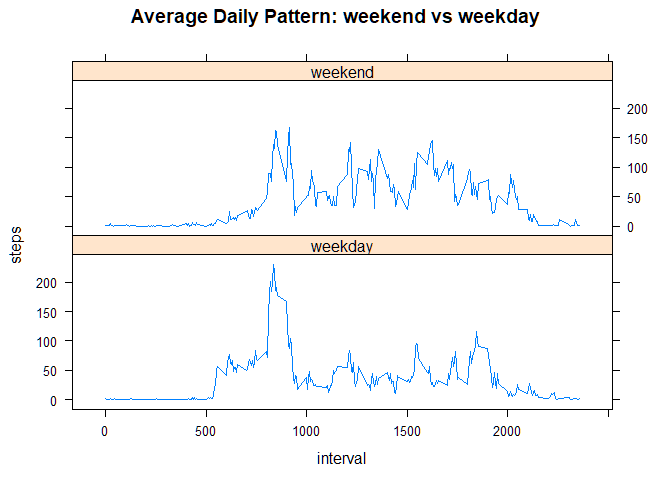

## Loading and preprocessing the data  


```r
fileUrl <- "https://d396qusza40orc.cloudfront.net/repdata%2Fdata%2Factivity.zip"
download.file(fileUrl,destfile="./activity.zip",method="curl")
unzip(zipfile="./activity.zip",exdir=".")

df<-read.csv("activity.csv", na.strings = "NA")
df$date<-as.Date(df$date)
str(df)
```

```
## 'data.frame':	17568 obs. of  3 variables:
##  $ steps   : int  NA NA NA NA NA NA NA NA NA NA ...
##  $ date    : Date, format: "2012-10-01" "2012-10-01" ...
##  $ interval: int  0 5 10 15 20 25 30 35 40 45 ...
```


## What is mean total number of steps taken per day?
### I create a summary table with mean, median and total number of steps per day  


```r
library(dplyr)
```

```
## 
## Attaching package: 'dplyr'
```

```
## The following objects are masked from 'package:stats':
## 
##     filter, lag
```

```
## The following objects are masked from 'package:base':
## 
##     intersect, setdiff, setequal, union
```

```r
totsteps<-group_by(df, date)
sumsteps<-summarize(totsteps, steps=mean(steps, na.rm=T))
```

```
## `summarise()` ungrouping output (override with `.groups` argument)
```

```r
sumsteps<-rename(sumsteps, Mean_steps=steps)
sumsteps<-merge(sumsteps, summarize(totsteps, steps=median(steps, na.rm=T)))
```

```
## `summarise()` ungrouping output (override with `.groups` argument)
```

```r
sumsteps<-rename(sumsteps, Median_steps=steps)
sumsteps<-merge(sumsteps, summarize(totsteps, steps=sum(steps, na.rm=T)))
```

```
## `summarise()` ungrouping output (override with `.groups` argument)
```

```r
sumsteps<-rename(sumsteps, Sum_steps=steps)
str(sumsteps)
```

```
## 'data.frame':	61 obs. of  4 variables:
##  $ date        : Date, format: "2012-10-01" "2012-10-02" ...
##  $ Mean_steps  : num  NaN 0.438 39.417 42.069 46.16 ...
##  $ Median_steps: num  NA 0 0 0 0 0 0 NA 0 0 ...
##  $ Sum_steps   : int  0 126 11352 12116 13294 15420 11015 0 12811 9900 ...
```
  
### I create a histogram of the total number of steps taken each day  


```r
hist(sumsteps$Sum_steps, main = "Total number of steps per day", xlab = "Total number of steps in a day")
```

<!-- -->

### I report a table with mean and median values of steps per day  


```r
subset(sumsteps, select=c(date, Mean_steps, Median_steps))
```

```
##          date Mean_steps Median_steps
## 1  2012-10-01        NaN           NA
## 2  2012-10-02  0.4375000            0
## 3  2012-10-03 39.4166667            0
## 4  2012-10-04 42.0694444            0
## 5  2012-10-05 46.1597222            0
## 6  2012-10-06 53.5416667            0
## 7  2012-10-07 38.2465278            0
## 8  2012-10-08        NaN           NA
## 9  2012-10-09 44.4826389            0
## 10 2012-10-10 34.3750000            0
## 11 2012-10-11 35.7777778            0
## 12 2012-10-12 60.3541667            0
## 13 2012-10-13 43.1458333            0
## 14 2012-10-14 52.4236111            0
## 15 2012-10-15 35.2048611            0
## 16 2012-10-16 52.3750000            0
## 17 2012-10-17 46.7083333            0
## 18 2012-10-18 34.9166667            0
## 19 2012-10-19 41.0729167            0
## 20 2012-10-20 36.0937500            0
## 21 2012-10-21 30.6284722            0
## 22 2012-10-22 46.7361111            0
## 23 2012-10-23 30.9652778            0
## 24 2012-10-24 29.0104167            0
## 25 2012-10-25  8.6527778            0
## 26 2012-10-26 23.5347222            0
## 27 2012-10-27 35.1354167            0
## 28 2012-10-28 39.7847222            0
## 29 2012-10-29 17.4236111            0
## 30 2012-10-30 34.0937500            0
## 31 2012-10-31 53.5208333            0
## 32 2012-11-01        NaN           NA
## 33 2012-11-02 36.8055556            0
## 34 2012-11-03 36.7048611            0
## 35 2012-11-04        NaN           NA
## 36 2012-11-05 36.2465278            0
## 37 2012-11-06 28.9375000            0
## 38 2012-11-07 44.7326389            0
## 39 2012-11-08 11.1770833            0
## 40 2012-11-09        NaN           NA
## 41 2012-11-10        NaN           NA
## 42 2012-11-11 43.7777778            0
## 43 2012-11-12 37.3784722            0
## 44 2012-11-13 25.4722222            0
## 45 2012-11-14        NaN           NA
## 46 2012-11-15  0.1423611            0
## 47 2012-11-16 18.8923611            0
## 48 2012-11-17 49.7881944            0
## 49 2012-11-18 52.4652778            0
## 50 2012-11-19 30.6979167            0
## 51 2012-11-20 15.5277778            0
## 52 2012-11-21 44.3993056            0
## 53 2012-11-22 70.9270833            0
## 54 2012-11-23 73.5902778            0
## 55 2012-11-24 50.2708333            0
## 56 2012-11-25 41.0902778            0
## 57 2012-11-26 38.7569444            0
## 58 2012-11-27 47.3819444            0
## 59 2012-11-28 35.3576389            0
## 60 2012-11-29 24.4687500            0
## 61 2012-11-30        NaN           NA
```


## What is the average daily activity pattern?

### I group the number of steps per interval and average them


```r
pattern<-group_by(df, interval)
pattern<-summarize(pattern, steps=mean(steps, na.rm=T))
```

```
## `summarise()` ungrouping output (override with `.groups` argument)
```

```r
str(pattern)
```

```
## tibble [288 x 2] (S3: tbl_df/tbl/data.frame)
##  $ interval: int [1:288] 0 5 10 15 20 25 30 35 40 45 ...
##  $ steps   : num [1:288] 1.717 0.3396 0.1321 0.1509 0.0755 ...
```


### I create a time series plot of the x-minute interval and the average number of steps acen across all days


```r
with(pattern, plot(interval, steps, type="l", main="Average daily activity pattern", xlab="5-minute interval", ylab="Mean number of steps"))
```

<!-- -->


## Imputing missing values

### I report the number of rows with missing values in the dataset


```r
nrow(df[!complete.cases(df),])
```

```
## [1] 2304
```
### I impute the missing values as the mean of the average values of steps in that day and in that interval; I will check the number of incomplete cases in the new dataframe.


```r
imp<-df

for (i in pattern$interval) {
    imp[imp$interval == i & is.na(imp$steps), ]$steps <-         pattern$steps[pattern$interval == i]
}
print(paste("The number of incomplete rows is now ", nrow(imp[!complete.cases(imp),])))
```

```
## [1] "The number of incomplete rows is now  0"
```
### I create a new summary table with imputed data.


```r
totimpute<-group_by(imp, date)
sum2<-summarize(totimpute, steps=mean(steps, na.rm=T))
```

```
## `summarise()` ungrouping output (override with `.groups` argument)
```

```r
sum2<-rename(sum2, Mean_steps=steps)
sum2<-merge(sum2, summarize(totimpute, steps=median(steps, na.rm=T)))
```

```
## `summarise()` ungrouping output (override with `.groups` argument)
```

```r
sum2<-rename(sum2, Median_steps=steps)
sum2<-merge(sum2, summarize(totimpute, steps=sum(steps, na.rm=T)))
```

```
## `summarise()` ungrouping output (override with `.groups` argument)
```

```r
sum2<-rename(sum2, Sum_steps=steps)
str(sum2)
```

```
## 'data.frame':	61 obs. of  4 variables:
##  $ date        : Date, format: "2012-10-01" "2012-10-02" ...
##  $ Mean_steps  : num  37.383 0.438 39.417 42.069 46.16 ...
##  $ Median_steps: num  34.1 0 0 0 0 ...
##  $ Sum_steps   : num  10766 126 11352 12116 13294 ...
```
### I create a histogram of the total number of steps taken each day with imputed data


```r
hist(sum2$Sum_steps, main = "Total number of steps per day", xlab = "Total number of steps in a day")
```

<!-- -->
### I report a table with mean and median values of steps per day and the differences with the previous values


```r
delta<-subset(sum2, select=c(date, Mean_steps, Median_steps))
delta$difference_Mean<-  sum2$Mean_steps + sumsteps$Mean_steps*(-1)
delta$difference_Median<- sum2$Median_steps + sumsteps$Median_steps*(-1)
```

### Except for the days that had no measurements at all, there are no differences in mean and median values per day

## Are there differences in activity patterns between weekdays and weekends?

### I add a new column to the imputed dataset with the weekday and then I make a panel plot with the time series of the 5-minute interval and the average number of steps taken, averaged across all weekdays or weekends.

```r
imp$Weekday<-weekdays(imp$date)
imp[imp$Weekday == "lunedì" | imp$Weekday == "martedì" | imp$Weekday == "mercoledì" | imp$Weekday == "giovedì" | imp$Weekday == "venerdì", ]$Weekday <- "weekday"
imp[imp$Weekday == "sabato" | imp$Weekday == "domenica", ] $Weekday<-"weekend" 

imp$Weekday <- factor(imp$Weekday)

weekend <- summarise(group_by(imp, interval)[imp$Weekday=="weekend", ], steps=mean(steps))
```

```
## `summarise()` ungrouping output (override with `.groups` argument)
```

```r
weekend$day <- "weekend"

weekday <- summarise(group_by(imp, interval)[imp$Weekday=="weekday", ], steps=mean(steps))
```

```
## `summarise()` ungrouping output (override with `.groups` argument)
```

```r
weekday$day <- "weekday"

week<-rbind(weekend, weekday)


library(lattice)
library(png)
xyplot(steps~interval|day, week, layout=c(1,2), type="l", main="Average Daily Pattern: weekend vs weekday")
```

<!-- -->

